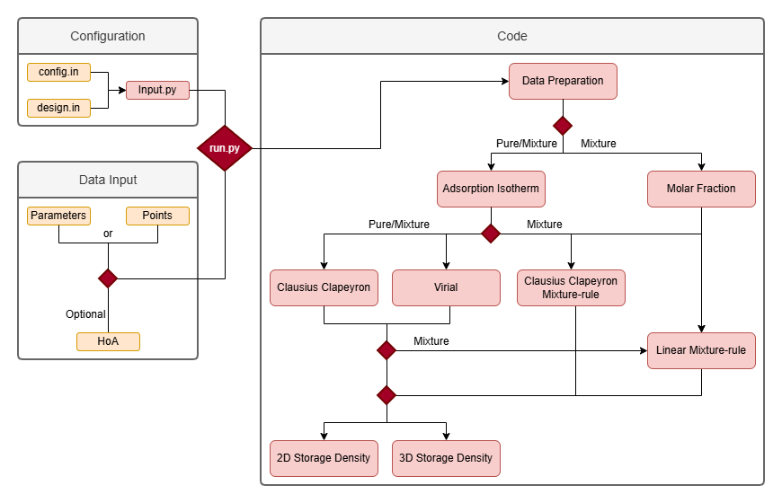

# Mixture adsorption thermodynamics

Python workflow for **mixed-gas adsorption**: isotherm-based analysis, **heat of adsorption** (virial expansion and Clausius–Clapeyron routes, optional HOA input files), and **storage density** (including mixture formulations and 3D views). Intended as a configurable pipeline driven by tabular input data.



## Requirements

- **Python** 3.10 or newer  
- **Packages:** `numpy`, `scipy`, `matplotlib`, `pandas` (see note below)

Install dependencies (from the repository root):

```bash
pip install numpy scipy matplotlib pandas
```

`pandas` is imported by the plotting helpers; keep it installed even if you only use NumPy-style data elsewhere.

## How to run

From the repository root (so paths in `config.in` resolve correctly):

```bash
python run.py
```

`run.py` executes `Code/Main.py` with the working directory set to the project root. Plots use Matplotlib’s **Agg** backend (non-interactive, suitable for servers and batch runs).

## Configuration

| File | Role |
|------|------|
| **`config.in`** | Adsorbent/adsorbate selection, temperatures, pressure range, data sources, which HOA and storage-density modes to run, virial settings, output flags, etc. |
| **`design.in`** | Plot styling: colours, line styles, markers, colormaps for structures, molecules, temperatures, and storage-density 3D figures. |

Important keys in `config.in` (see comments in the file for full detail):

- **`DATA_SOURCE`:** `fitting` (isotherm parameters) or `points` (simulation / tabulated points).  
- **`DATA_FILE_FITTING`**, **`DATA_FILE_POINTS`**, **`DATA_FILE_HOA`:** paths to input tables (relative to repo root).  
- **`HEAT_OF_ADSORPTION`**, **`HEAT_OF_ADSORPTION_MIX`**, **`STORAGE_DENSITY`:** enable virial, Clausius–Clapeyron, file-based HOA, or combinations.  
- **`OUT_DIR`:** write figures and summaries under **`Output/`** when enabled.

## Input data

Place (or point `config.in` to) text files under **`Input/`**, for example:

- Isotherm parameters or pressure–loading points for fitting and thermodynamic analysis.  
- Optional dedicated **heat-of-adsorption** tables when using file-based HOA modes.

Formats are defined by the reader logic in `Code/Input.py` and the rest of the pipeline; keep column layouts consistent with your existing example files.

## Project layout

```
Code/
  Main.py           # Pipeline entry (orchestration, plotting, exports)
  Input.py          # Loads config.in and design.in
  functions/        # Virial, Clausius–Clapeyron, storage density, mol fractions, plots, …
Input/              # User data (tracked examples or your own)
Output/             # Generated plots and summary text (when enabled)
config.in           # Run configuration
design.in           # Visual design mappings
run.py              # Wrapper: run Main.py from repo root
Workflow.png        # High-level workflow diagram for the README
```

## Outputs

With output options turned on in `config.in`, results are written under **`Output/<case_label>/`** (naming depends on adsorbent, adsorbate, temperatures, and similar selections). Typical artefacts include figures (PNG/PDF as configured) and summary text files.

---


